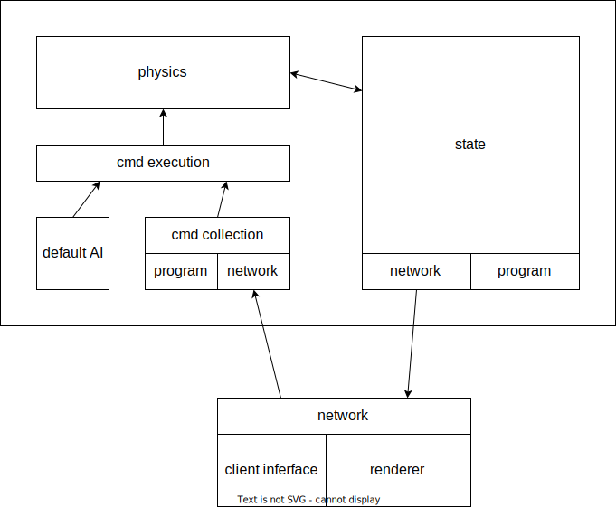

# ggs

The main idea is an act-react loop. An agent, either AI or player, takes an action by changing its own state. Then the phisics law react to the agent by changing the state of the world.

data in: cmd
- admin: controlling program flow
  - save/load
  - pause/resume
- player: controlling agents

data out:
- state
